<!-- Generated by scripts/build_assets.py. Edit the script, not this file. -->

<picture>
  <source media="(max-width: 600px) and (prefers-color-scheme: dark)" srcset="assets/m/header-dark.svg">
  <source media="(max-width: 600px)" srcset="assets/m/header-light.svg">
  <source media="(prefers-color-scheme: dark)" srcset="assets/header-dark.svg">
  
</picture>

  <a href="https://linkedin.com/in/kmehul992"><picture><source media="(prefers-color-scheme: dark)" srcset="assets/btn-linkedin-dark.svg"></picture></a>
  &nbsp;
  <a href="https://kmehul.github.io"><picture><source media="(prefers-color-scheme: dark)" srcset="assets/btn-portfolio-dark.svg"></picture></a>
  &nbsp;
  <a href="mailto:kumar-mehul_1@outlook.com"><picture><source media="(prefers-color-scheme: dark)" srcset="assets/btn-email-dark.svg"></picture></a>

<picture>
  <source media="(max-width: 600px) and (prefers-color-scheme: dark)" srcset="assets/m/about-dark.svg">
  <source media="(max-width: 600px)" srcset="assets/m/about-light.svg">
  <source media="(prefers-color-scheme: dark)" srcset="assets/about-dark.svg">
  
</picture>

<picture>
  <source media="(max-width: 600px) and (prefers-color-scheme: dark)" srcset="assets/m/experience-dark.svg">
  <source media="(max-width: 600px)" srcset="assets/m/experience-light.svg">
  <source media="(prefers-color-scheme: dark)" srcset="assets/experience-dark.svg">
  
</picture>

<picture>
  <source media="(max-width: 600px) and (prefers-color-scheme: dark)" srcset="assets/m/citibike-dark.svg">
  <source media="(max-width: 600px)" srcset="assets/m/citibike-light.svg">
  <source media="(prefers-color-scheme: dark)" srcset="assets/citibike-dark.svg">
  
</picture>

  <a href="https://public.tableau.com/shared/WW7ZSRM8C?:display_count=n&amp;:origin=viz_share_link"><picture><source media="(prefers-color-scheme: dark)" srcset="assets/btn-dashboard-dark.svg"></picture></a>
  &nbsp;
  <a href="https://github.com/kmehul/citibike-jc-mobility-analysis"><picture><source media="(prefers-color-scheme: dark)" srcset="assets/btn-repo-dark.svg"></picture></a>

<picture>
  <source media="(max-width: 600px) and (prefers-color-scheme: dark)" srcset="assets/m/imdb-dark.svg">
  <source media="(max-width: 600px)" srcset="assets/m/imdb-light.svg">
  <source media="(prefers-color-scheme: dark)" srcset="assets/imdb-dark.svg">
  
</picture>

  <a href="https://github.com/kmehul/IMDB-Movie-Data-Analysis"><picture><source media="(prefers-color-scheme: dark)" srcset="assets/btn-repo-dark.svg"></picture></a>

<picture>
  <source media="(max-width: 600px) and (prefers-color-scheme: dark)" srcset="assets/m/food-dark.svg">
  <source media="(max-width: 600px)" srcset="assets/m/food-light.svg">
  <source media="(prefers-color-scheme: dark)" srcset="assets/food-dark.svg">
  
</picture>

  <a href="https://github.com/kmehul/California-Food-Inspection-Analysis"><picture><source media="(prefers-color-scheme: dark)" srcset="assets/btn-repo-dark.svg"></picture></a>

<picture>
  <source media="(max-width: 600px) and (prefers-color-scheme: dark)" srcset="assets/m/tracker-dark.svg">
  <source media="(max-width: 600px)" srcset="assets/m/tracker-light.svg">
  <source media="(prefers-color-scheme: dark)" srcset="assets/tracker-dark.svg">
  
</picture>

  <a href="https://github.com/kmehul/apple-music-release-tracker"><picture><source media="(prefers-color-scheme: dark)" srcset="assets/btn-repo-dark.svg"></picture></a>

<picture>
  <source media="(max-width: 600px) and (prefers-color-scheme: dark)" srcset="assets/m/toolkit-dark.svg">
  <source media="(max-width: 600px)" srcset="assets/m/toolkit-light.svg">
  <source media="(prefers-color-scheme: dark)" srcset="assets/toolkit-dark.svg">
  
</picture>

<picture>
  <source media="(max-width: 600px) and (prefers-color-scheme: dark)" srcset="assets/m/education-dark.svg">
  <source media="(max-width: 600px)" srcset="assets/m/education-light.svg">
  <source media="(prefers-color-scheme: dark)" srcset="assets/education-dark.svg">
  
</picture>

  <a href="https://linkedin.com/in/kmehul992"><picture><source media="(prefers-color-scheme: dark)" srcset="assets/btn-linkedin-dark.svg"></picture></a>
  &nbsp;
  <a href="https://kmehul.github.io"><picture><source media="(prefers-color-scheme: dark)" srcset="assets/btn-portfolio-dark.svg"></picture></a>
  &nbsp;
  <a href="mailto:kumar-mehul_1@outlook.com"><picture><source media="(prefers-color-scheme: dark)" srcset="assets/btn-email-dark.svg"></picture></a>

